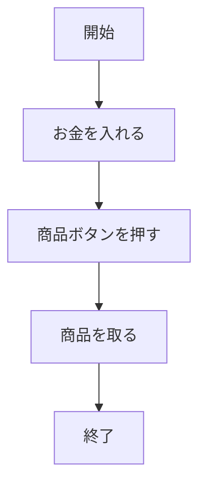
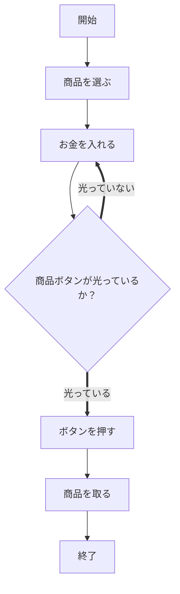
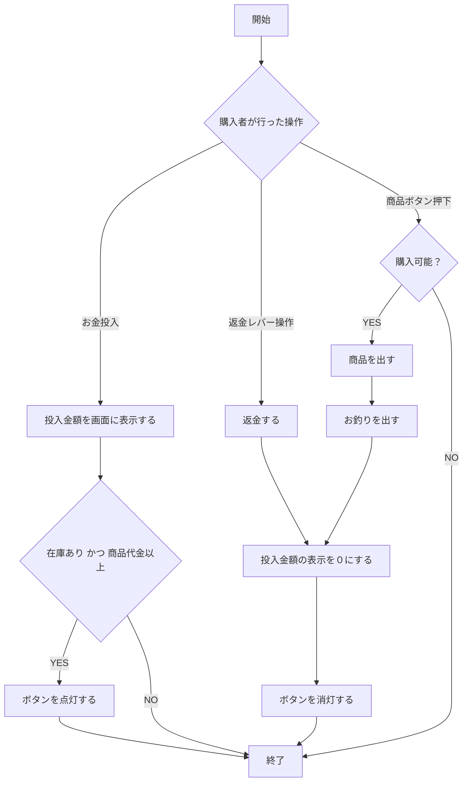

目次：[プログラミング学習]({{ site.baseurl }})

---

プログラミングの問題でよく見るのが自動販売機です。入社試験などでもよく見かけます。
実際に自動販売機のプログラムを作るということではなく、フローチャートを作るという問題が多いのではないでしょうか。
今回は自動販売機のフローチャートを作ってみましょう。

# 購入者

フローチャートを書く時に気をつけているのは「誰が何をするのか」が誤解されないようにすることです。
上図では「購入者が」行う処理を書いていますので自動販売機については何も書いていません。
購入者の処理についても不足しています。もっと複雑なことをやっているはずですし、何か条件分岐もあるはずです。

お金を入れても購入可能のランプがつかなければ商品は買えませんよね。
これでも足りませんよね？ 売り切れランプがついてるか？ 釣り銭不足のランプはついていないか？ など
欲しい商品はあるか？ という条件分岐もありますね。出て来た商品が間違えてるか確認するとか、、、

# 自動販売機

自動販売機のフローチャートを考えてみましょう
細かく書いていくとフローチャートの数が増えていってしまうので可能な限り単純に考えてみたいと思います。

1. 購入者はお金を入れる。お金は何度でも入れられ上限金額なし、釣り銭切れは発生しない。
2. 購入可能な商品のボタンを光らせる。
3. 購入者がボタンを押したら、それが購入可能であれば商品を出す。
4. お釣りを出して終了
5. 商品が購入可能であるというのは、在庫があり、かつ投入金額が商品代金以上
6. 購入者がお金を投入してからの経過時間は考慮しない。

釣り銭ぎれや投入金額の上限、時間経過、電子マネーなど色々と考え始めたら止まりませんね。
一万円札、五千円札なども考慮し始めるとフローチャートが巨大になっていきますので無視することにしました。

購入者が自動販売機に対してできることは「お金を入れる」「返金レバーを回す」「商品ボタンを押す」とします。

購入者の操作により自動販売機が何か処理をするとしています。処理が終了すると自動販売機は待機状態に遷移します。
多くの自販機はお金が投入されてから一定時間、購入者が何も操作をしないと返金するようになっていますので、
待機状態は投入された金額が0円と1円以上では待機処理は異なるものになります。考え始めると止まりませんね。
投入されたお金は本物なのか？お金を保管する入れ物も満タンなのか空っぽなのかとか気になります。
硬貨が満タンだと130円の商品を買うには千円札だけしかダメっていう処理になるんでしょうか？
購入ボタンを押した後に商品が出たかどうかもチェックしたくなりますね。本当に止まらなくなって来ました。
ここらへんでやめておきます。

